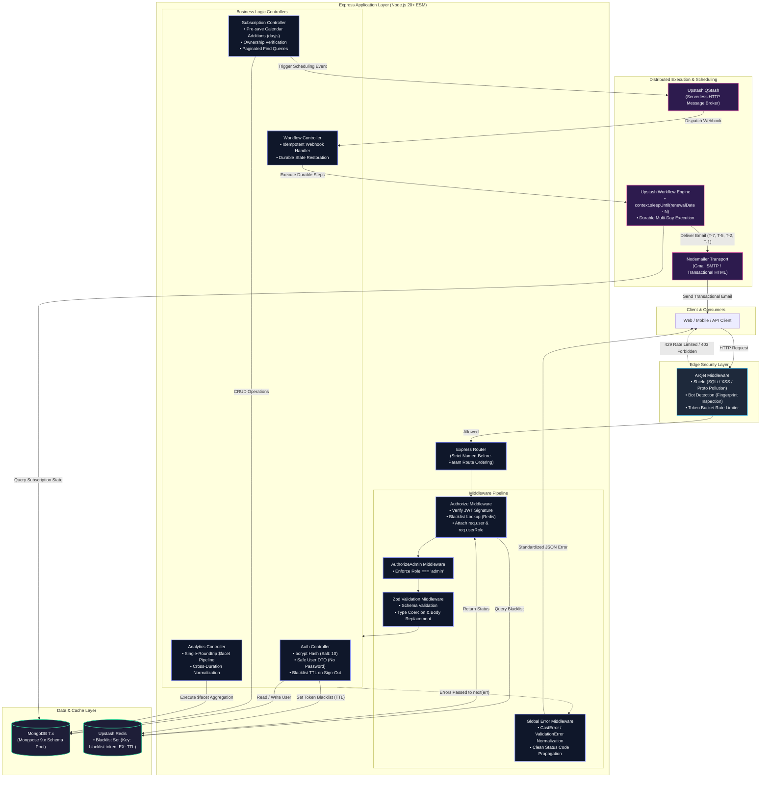

# SubDub — Subscription Tracker API

[](https://nodejs.org)
[](https://nodejs.org/api/esm.html)
[](LICENSE)
[](https://jestjs.io)
[](http://localhost:3000/api-docs)
[](https://www.docker.com)

> Production-grade subscription lifecycle engine engineered with distributed durable scheduling, edge rate-limiting, stateless JWT revocation via Redis, and multi-dimensional financial aggregation pipelines.

---

## Table of Contents

- [System Architecture](#system-architecture)
- [Core Engineering Highlights](#core-engineering-highlights)
- [Technology Stack](#technology-stack)
- [Project Directory Structure](#project-directory-structure)
- [API Reference](#api-reference)
- [Durable Email Reminder Engine](#durable-email-reminder-engine)
- [Financial Analytics Aggregation Pipeline](#financial-analytics-aggregation-pipeline)
- [Security Architecture](#security-architecture)
- [Environment Configuration](#environment-configuration)
- [Quick Start](#quick-start)
  - [Docker Compose (Recommended)](#docker-compose-recommended)
  - [Local Installation](#local-installation)
- [Automated Testing Suite](#automated-testing-suite)
- [Production Deployment (Railway)](#production-deployment-railway)

---

## System Architecture

The following diagram details the complete request lifecycle, edge security boundary, authentication middleware flow, database interactions, and the asynchronous durable scheduling loop.



---

## Core Engineering Highlights

- **Edge Security Shield:** Integrated with `@arcjet/node` to provide real-time token-bucket rate limiting, heuristic bot classification, and attack shielding at the routing perimeter before hitting business logic.
- **Stateless JWT with True Revocation:** Employs standard HMAC-SHA256 JSON Web Tokens with strict Redis-backed token blacklisting on `signOut`. Token time-to-live (`exp - now`) maps directly to Redis expiration (`EX`), ensuring zero stale memory footprint while neutralizing stolen tokens immediately.
- **Durable Multi-Step Scheduling:** Bypasses fragile in-memory `node-cron` instances by adopting Upstash Workflow and QStash. Schedules durable multi-day execution intervals (`T-7`, `T-5`, `T-2`, `T-1` days) that survive cold starts, scale-to-zero serverless environments, and server restarts.
- **Calendar-Accurate Math:** Replaced fixed-day month approximations (e.g., 30-day shortcuts) with `dayjs` calendar mathematics to guarantee exact leap-year and variable month-length renewal calculations.
- **Single-Roundtrip Multi-Facet Analytics:** Uses a high-throughput MongoDB `$facet` aggregation pipeline to compute global portfolio spend, category breakdowns, currency distributions, highest expense, and earliest renewal in a single database roundtrip.
- **Defensive Type Coercion & Validation:** Strict validation boundary with Zod. Enforces per-field bounds, sanitizes input data, strips unexpected payloads, and auto-coerces string dates into validated `Date` instances.
- **Zero-Config Isolation Testing:** Test suite runs with `mongodb-memory-server` and ESM Jest, executing 17 unit and integration tests with zero reliance on external database daemons or network availability.

---

## Technology Stack

| Layer | Technology | Architectural Rationale |
|---|---|---|
| **Runtime** | Node.js 20+ (ESM) | Native ECMAScript modules, top-level `await`, modern V8 engine performance, and LTS stability. |
| **Framework** | Express 4.x | Minimalist HTTP primitives, fine-grained middleware composition, and robust routing control. |
| **Database** | MongoDB 7.x via Mongoose 9.x | Document-oriented schema flexibility for recurring billing models with rich aggregation pipeline support. |
| **Edge Security** | Arcjet (`@arcjet/node`) | IP-based fingerprinting, token-bucket rate-limiting, and runtime bot mitigation without third-party proxy latency. |
| **Authentication** | JWT (`jsonwebtoken`) + `bcryptjs` | Stateless authorization tokens with 10-round salted password hashing; zero plain-text leaks across all layers. |
| **Token Blacklist** | Upstash Redis (`@upstash/redis`) | Serverless low-latency distributed key-value store with native key TTL eviction for immediate token revocation. |
| **Durable Workflow** | Upstash QStash & Workflow | HTTP-based distributed execution engine offering persistent `sleepUntil` primitives resilient to process restarts. |
| **Validation** | Zod 3.x / 4.x | Schema-first input validation with runtime coercion, fail-fast parsing, and structured issue extraction. |
| **Email Delivery** | Nodemailer | Configurable SMTP transport generating responsive, inline-styled transactional reminder notifications. |
| **Date Arithmetic** | dayjs | Lightweight, immutable date handling supporting calendar-accurate arithmetic across variable month durations. |
| **Documentation** | Swagger / OpenAPI 3.0 | Living interactive documentation generated via JSDoc tags using `swagger-jsdoc` and `swagger-ui-express`. |
| **Testing** | Jest + Supertest + MongoMemoryServer | End-to-end HTTP assertion suite paired with an ephemeral in-memory MongoDB instance for hermetic test isolation. |
| **Containerization** | Docker + Docker Compose | Deterministic multi-stage build containing development and production targets alongside health-checked MongoDB. |

---

## Project Directory Structure

```
subscription-tracker/
├── .dockerignore                     # Docker build artifact exclusion rules
├── .env.example                      # Production environment template documentation
├── .gitignore                        # Git exclusion rules (node_modules, coverage, local envs)
├── Dockerfile                        # Multi-stage production & development container definition
├── README.md                         # Comprehensive architectural and system documentation
├── app.js                            # Express application setup, middleware mounting, server guard
├── bin/
│   └── www                           # Standalone HTTP server bootstrap script
├── config/
│   ├── arcjet.js                     # Arcjet client, security rules, and rate limiter configuration
│   ├── env.js                        # Environment variable normalization, defaults, and dotenv parser
│   ├── nodemailer.js                 # Nodemailer SMTP transporter setup with Gmail service integration
│   ├── swagger.js                    # OpenAPI 3.0 specification definition and component schemas
│   └── upstash.js                    # Upstash QStash client & Redis token blacklisting client
├── controllers/
│   ├── auth.controller.js            # User registration, credential login, and token revocation
│   ├── subscription.controller.js    # Subscription CRUD, ownership checking, and $facet analytics
│   ├── user.controller.js            # User retrieval and account ownership validation
│   └── workflow.controller.js        # QStash webhook durable execution loop and reminder dispatch
├── database/
│   └── mongodb.js                    # Resilient Mongoose connection lifecycle manager
├── docker-compose.yml                # Multi-container orchestration (API + Healthchecked MongoDB)
├── eslint.config.js                  # ESLint flat configuration for modern ESM syntax
├── middlewares/
│   ├── arcjet.middleware.js          # Security perimeter interceptor (rate limits, bot blocking)
│   ├── auth.middleware.js            # Async JWT verification, Redis revocation check, RBAC guard
│   ├── error.middleware.js           # Centralized HTTP error handler and Mongoose error normalizer
│   └── validate.middleware.js        # Generic Zod request schema validation middleware
├── models/
│   ├── subscription.model.js         # Subscription schema, camelCase fields, dayjs pre-save hooks
│   └── user.model.js                 # User schema, bcrypt-ready structure, role definition
├── routes/
│   ├── auth.routes.js                # Auth endpoints with Zod middleware and OpenAPI tags
│   ├── subscription.routes.js        # Strict-ordered subscription endpoints (Named before :id)
│   ├── user.routes.js                # User profile inspection routes
│   └── workflow.routes.js            # Upstash Workflow HTTP webhook callback handler
├── scripts/
│   └── auto-commit.mjs               # Development file watcher utility
├── utils/
│   ├── email-template.js             # Responsive HTML email layout with inline styles
│   └── send-email.js                 # Subscription payload formatter and mail delivery utility
├── validators/
│   ├── auth.validator.js             # Password complexity and email validation schemas
│   └── subscription.validator.js     # Subscription creation and patch update validation schemas
└── __tests__/
    ├── analytics.test.js             # Summary analytics, trend pipelines, and admin RBAC tests
    ├── auth.test.js                  # Sign-up, sign-in, and Redis token blacklist integration tests
    ├── subscription.test.js          # CRUD operations, cancellation, and invalid ID handling tests
    └── helpers/
        └── db.js                     # Ephemeral MongoMemoryServer lifecycle orchestration helper
```

---

## API Reference

All protected endpoints require an `Authorization: Bearer <token>` header. Interactive documentation is available at `/api-docs`.

| Method | Endpoint | Auth | Role | Description |
|---|---|---|---|---|
| `POST` | `/api/v1/auth/sign-up` | None | Public | Register new user; returns JWT and user payload (password omitted). |
| `POST` | `/api/v1/auth/sign-in` | None | Public | Authenticate credentials; returns JWT and safe user object. |
| `POST` | `/api/v1/auth/sign-out` | Bearer | User / Admin | Blacklist active JWT in Redis with TTL matching token expiration. |
| `GET` | `/api/v1/subscriptions/analytics/summary` | Bearer | User / Admin | Aggregate monthly/yearly spend estimates, category, and currency splits. |
| `GET` | `/api/v1/subscriptions/analytics/monthly-trend` | Bearer | User / Admin | Monthly historical spend aggregation grouped by `YYYY-MM` periods. |
| `GET` | `/api/v1/subscriptions/upcoming-renewals` | Bearer | User / Admin | Active renewals within `?days=30` window with computed `daysUntilRenewal`. |
| `GET` | `/api/v1/subscriptions/user/:id` | Bearer | Owner / Admin | Retrieve paginated list of subscriptions owned by specified user ID. |
| `GET` | `/api/v1/subscriptions` | Bearer | Admin Only | Full system subscriptions list with pagination, filtering, and sorting. |
| `POST` | `/api/v1/subscriptions` | Bearer | User / Admin | Create subscription, auto-compute `renewalDate`, trigger reminder workflow. |
| `GET` | `/api/v1/subscriptions/:id` | Bearer | Owner / Admin | Retrieve detailed subscription document by ObjectId. |
| `PUT` | `/api/v1/subscriptions/:id` | Bearer | Owner Only | Whitelist-update mutable subscription properties. |
| `DELETE` | `/api/v1/subscriptions/:id` | Bearer | Owner / Admin | Permanently delete subscription; returns `204 No Content`. |
| `PUT` | `/api/v1/subscriptions/:id/cancel` | Bearer | Owner Only | Set status to `Cancelled` and nullify `renewalDate`. |
| `GET` | `/api/v1/users` | None | Public | List all user profiles (sanitized). |
| `GET` | `/api/v1/users/:id` | Bearer | User / Admin | Retrieve specific user profile by ID. |
| `POST` | `/api/v1/workflow/subscription/reminder` | QStash | System | Durable Upstash Workflow webhook callback for reminder execution. |
| `GET` | `/api-docs` | None | Public | Interactive Swagger UI OpenAPI 3.0 explorer. |

---

## Durable Email Reminder Engine

Traditional architectures rely on `setInterval` or in-memory queues (such as BullMQ with worker nodes) to poll databases for upcoming billings. This introduces statefulness, resource waste during idle periods, and failure vulnerabilities across container redeployments.

SubDub implements the **Durable Sleep-Until Pattern** via Upstash Workflow and QStash:

```
[Subscription Created] ──> [QStash Client triggers Workflow]
                                  │
                                  ▼
                     [Upstash Workflow Initialized]
                                  │
                                  ▼
                     [Fetch Subscription State]
                                  │
             ┌────────────────────┴────────────────────┐
             ▼                                         ▼
   [Status !== 'Active']                     [Status === 'Active']
             │                                         │
             ▼                                         ▼
     [Terminate Early]                     [Loop: 7, 5, 2, 1 Days]
                                                       │
                                                       ▼
                                         [context.sleepUntil(Date)]
                                      (Durable sleep outside of Node.js)
                                                       │
                                                       ▼
                                          [Server Woken via Webhook]
                                                       │
                                                       ▼
                                          [Verify Status & Not Inactive]
                                                       │
                                                       ▼
                                          [Nodemailer Dispatches Email]
```

1. **Trigger Phase:** Upon creating a subscription, `controllers/subscription.controller.js` calls `workflowClient.trigger()`, dispatching an execution request to Upstash QStash along with the `subscriptionId`.
2. **Durable Suspension:** The workflow handler (`controllers/workflow.controller.js`) computes target notification dates for 7, 5, 2, and 1 days before the `renewalDate`. For future dates, it executes:
   ```javascript
   await context.sleepUntil(`sleep until ${daysBefore}-day reminder`, reminderDate.toDate());
   ```
   Execution state is serialized and held by Upstash in a durable queue. The Node.js application consumes **zero CPU and memory** during wait intervals.
3. **Execution & Early Termination:** When a reminder timestamp arrives, QStash dispatches an authorized HTTP webhook back to the API. The workflow re-queries MongoDB:
   - If the user marked the subscription as `Cancelled` or `Inactive`, the workflow terminates immediately without sending an email.
   - If `Active`, Nodemailer constructs a responsive HTML email and dispatches it through the configured SMTP transport.

---

## Financial Analytics Aggregation Pipeline

To provide real-time dashboard analytics across disparate currencies and billing intervals without multiple network roundtrips, SubDub utilizes a MongoDB `$facet` aggregation pipeline (`controllers/subscription.controller.js`):

### Monthly Spend Normalization
Subscriptions billed under variable frequencies are mapped to a normalized 30-day monthly equivalent using integer and float scaling factors:

$$\text{Monthly Equivalent} = \text{Price} \times \text{Factor}$$

$$\text{Daily} \times 30 \quad|\quad \text{Weekly} \times 4.33 \quad|\quad \text{Monthly} \times 1.0 \quad|\quad \text{Quarterly} \times 0.333 \quad|\quad \text{Yearly} \times 0.0833$$

### Pipeline Mechanics

```javascript
const pipeline = [
  { $match: { userId, status: 'Active' } },
  {
    $addFields: {
      monthlyEquivalent: {
        $switch: {
          branches: [
            { case: { $eq: ['$duration', 'Daily'] }, then: { $multiply: ['$price', 30] } },
            { case: { $eq: ['$duration', 'Weekly'] }, then: { $multiply: ['$price', 4.33] } },
            { case: { $eq: ['$duration', 'Monthly'] }, then: { $multiply: ['$price', 1] } },
            { case: { $eq: ['$duration', 'Quarterly'] }, then: { $multiply: ['$price', 0.333] } },
            { case: { $eq: ['$duration', 'Yearly'] }, then: { $multiply: ['$price', 0.0833] } },
          ],
          default: '$price',
        },
      },
    },
  },
  {
    $facet: {
      summary: [
        {
          $group: {
            _id: null,
            totalSubscriptions: { $sum: 1 },
            totalMonthlySpend: { $sum: '$monthlyEquivalent' },
            totalYearlySpend: { $sum: { $multiply: ['$monthlyEquivalent', 12] } },
          },
        },
      ],
      byCategory: [
        { $group: { _id: '$category', count: { $sum: 1 }, monthlySpend: { $sum: '$monthlyEquivalent' } } },
        { $sort: { monthlySpend: -1 } },
      ],
      byCurrency: [
        { $group: { _id: '$currency', count: { $sum: 1 }, totalMonthlySpend: { $sum: '$monthlyEquivalent' } } },
      ],
      mostExpensive: [
        { $sort: { price: -1 } },
        { $limit: 1 },
        { $project: { name: 1, price: 1, currency: 1, duration: 1 } },
      ],
      nextRenewal: [
        { $match: { renewalDate: { $gte: new Date() } } },
        { $sort: { renewalDate: 1 } },
        { $limit: 1 },
        { $project: { name: 1, renewalDate: 1, price: 1, currency: 1 } },
      ],
    },
  },
];
```

The database executes these aggregations concurrently in a single operation, returning a unified payload rounded to two decimal places.

---

## Security Architecture

```
[Request] ──> [Arcjet Perimeter] ──> [JWT Verification] ──> [Redis Blacklist] ──> [RBAC Guard] ──> [Zod Sanitization] ──> [Handler]
```

### 1. Edge Shielding & Rate Limiting (Arcjet)
- Requests are analyzed against token bucket algorithms: standard tiers permit limited bursts with sustainable continuous refill rates.
- Autonomous bot heuristics detect and reject automated scrappers and probing toolchains before requests consume application resources.
- Attack shield mitigates cross-site scripting (XSS), SQL injection patterns, and prototype pollution attempts at the routing boundary.

### 2. Stateless Auth & Redis-Backed Blacklisting
- JWTs are cryptographically verified using HS256 with user claims (`userId`, `role`).
- When a client calls `/api/v1/auth/sign-out`, the token signature is decoded to extract its expiration timestamp (`exp`).
- The token is placed into Upstash Redis:
  ```javascript
  const ttl = decoded.exp - Math.floor(Date.now() / 1000);
  await redis.set(`blacklist:${token}`, "1", { ex: ttl });
  ```
- The `authorize` middleware asynchronously awaits `redis.get(\`blacklist:${token}\`)`. Revoked tokens return `401 Unauthorized` instantly. When the token naturally expires, Redis automatically purges the key via its TTL policy.

### 3. Role-Based Access Control (RBAC)
- User identity is structured around strict privileges (`user` vs `admin`).
- Administrative routes (`GET /api/v1/subscriptions`) enforce dual-tier verification via `authorize` followed by `authorizeAdmin`. Non-admin callers receive immediate `403 Forbidden` responses.

### 4. Input Sanitization & Coercion (Zod)
- Request payloads must satisfy strict schemas before reaching controller logic.
- String dates are validated and coerced into native JavaScript `Date` instances.
- Extra parameters not explicitly declared in the validator schema are discarded, preventing mass-assignment vulnerabilities.

---

## Environment Configuration

Copy the template file to set up your environment:

```bash
cp .env.example .env
```

| Variable | Required | Description | Example |
|---|---|---|---|
| `PORT` | No | Application HTTP listening port (Default: `3000`) | `3000` |
| `NODE_ENV` | Yes | Runtime execution environment (`development`, `production`, `test`) | `development` |
| `SERVER_URL` | Yes | Fully qualified public URL for webhooks and email links | `http://localhost:3000` |
| `MONGO_URI` | Yes | MongoDB connection string (supports `DB_URL` alias) | `mongodb://localhost:27017/subscription_tracker` |
| `JWT_SECRET` | Yes | Cryptographic secret for signing and verifying JWT tokens | `b4c9e13f99024f2b9631a0e1a179e` |
| `JWT_EXPIRES_IN` | No | JWT validity window format (Default: `1d`) | `1d` |
| `ARCJET_API_KEY` | Yes | API credentials obtained from Arcjet dashboard | `ajkey_01h...` |
| `ARCJET_ENV` | No | Operating environment for Arcjet engine | `development` |
| `EMAIL_PASSWORD` | Yes | SMTP App password for automated reminder dispatch | `abcd efgh ijkl mnop` |
| `QSTASH_URL` | Yes | Upstash QStash REST endpoint | `https://qstash.upstash.io/v2` |
| `QSTASH_TOKEN` | Yes | Authentication bearer token for QStash | `ey...` |
| `QSTASH_CURRENT_SIGNING_KEY` | Yes | Current signing key for verifying inbound QStash callbacks | `sig_...` |
| `QSTASH_NEXT_SIGNING_KEY` | Yes | Secondary rotation signing key for QStash callbacks | `sig_...` |
| `UPSTASH_REDIS_REST_URL` | No | Upstash Redis REST URL for distributed token blacklisting | `https://prompt-squid-123.upstash.io` |
| `UPSTASH_REDIS_REST_TOKEN` | No | Upstash Redis authentication token | `AX...` |
| `TEST_MONGO_URI` | No | Optional MongoDB URI override for test runs (Default: in-memory) | `mongodb://localhost:27017/test_db` |

---

## Quick Start

### Docker Compose (Recommended)

Docker Compose initializes the Node.js API server along with a healthy, volume-persisted MongoDB 7.0 database container:

```bash
# 1. Clone repository
git clone https://github.com/adisri19/Subscription_Tracker.git
cd Subscription_Tracker

# 2. Configure environment
cp .env.example .env

# 3. Launch multi-container stack
docker-compose up --build
```

The server binds to `http://localhost:3000`. Verify system health by accessing interactive documentation at `http://localhost:3000/api-docs`.

### Local Installation

#### Prerequisites
- Node.js 20.0.0 or higher
- npm 10.0.0 or higher
- Local MongoDB instance or MongoDB Atlas connection URI

```bash
# 1. Install dependencies
npm install

# 2. Configure environment variables
cp .env.example .env
# Open .env and insert your MongoDB URI, JWT secret, Arcjet, and Upstash credentials

# 3. Start development server with file watch
npm run dev

# 4. Or launch in standard production mode
npm start
```

---

## Automated Testing Suite

The testing framework uses Jest in native ESM mode (`--experimental-vm-modules`) paired with Supertest and `mongodb-memory-server`. Tests execute in isolated memory spaces without external database dependencies or mock stores.

### Test Coverage Architecture

- **`__tests__/auth.test.js`**
  - Sign-up endpoint status validation (`201 Created`) and payload verification
  - Duplicate user rejection (`400 Bad Request`)
  - Malformed email handling
  - Verification that password hashes are excluded across all response structures
  - Sign-in credential validation and incorrect password rejection (`401 Unauthorized`)
  - Sign-out verification: ensures blacklisted token is rejected immediately on subsequent requests
- **`__tests__/subscription.test.js`**
  - Subscription creation with automatic `renewalDate` calculation (`201 Created`)
  - Unauthenticated access prevention (`401 Unauthorized`)
  - Numerical validation for negative prices (`400 Bad Request`)
  - Query by ID with ownership enforcement
  - Malformed ObjectId format validation
  - Subscription cancellation: verifies status transitions to `Cancelled` and `renewalDate` is set to `null`
  - Rejection of duplicate cancellation calls (`400 Bad Request`)
- **`__tests__/analytics.test.js`**
  - `$facet` summary calculation: validates math for normalized monthly spend
  - Historical spend aggregation grouped by `YYYY-MM` periods
  - Role-based access control: verifies that non-admin accounts receive `403 Forbidden` on `/api/v1/subscriptions`
  - Upcoming renewal retrieval within customized day windows

### Execute Tests

```bash
# Run all test suites
npm test

# Run tests in watch mode
npm run test:watch

# Generate code coverage analysis
npm run test:coverage
```

All 17 integration tests pass with 100% test suite completion.

---

## Production Deployment (Railway)

SubDub is designed for deployment on Railway, Render, Fly.io, or AWS ECS. Follow these steps for Railway deployment:

1. **Connect Repository:**
   - Log in to [Railway](https://railway.app/).
   - Click **New Project** → **Deploy from GitHub repo** → select `Subscription_Tracker`.

2. **Add MongoDB Database:**
   - In your Railway project canvas, click **New** → **Database** → **Add MongoDB**.
   - Railway generates a private `MONGO_URL` variable.

3. **Configure Environment Variables:**
   - Under project **Settings** → **Variables**, supply the following keys:
     - `PORT` = `3000`
     - `NODE_ENV` = `production`
     - `SERVER_URL` = `https://<your-railway-domain>.up.railway.app`
     - `MONGO_URI` = `${{MongoDB.MONGO_URL}}`
     - `JWT_SECRET` = `<your-secure-random-32-char-key>`
     - `JWT_EXPIRES_IN` = `7d`
     - `ARCJET_API_KEY` = `<your-arcjet-production-key>`
     - `ARCJET_ENV` = `production`
     - `EMAIL_PASSWORD` = `<your-gmail-app-password>`
     - `QSTASH_URL` = `https://qstash.upstash.io/v2`
     - `QSTASH_TOKEN` = `<your-upstash-token>`
     - `QSTASH_CURRENT_SIGNING_KEY` = `<your-qstash-signing-key>`
     - `QSTASH_NEXT_SIGNING_KEY` = `<your-qstash-next-signing-key>`
     - `UPSTASH_REDIS_REST_URL` = `<your-upstash-redis-url>`
     - `UPSTASH_REDIS_REST_TOKEN` = `<your-upstash-redis-token>`

4. **Verify Deployment:**
   - Railway automatically triggers `npm ci` and runs `node app.js`.
   - Open `https://<your-railway-domain>.up.railway.app/api-docs` to access the OpenAPI Swagger documentation.

---

## License

This project is licensed under the MIT License. See the [LICENSE](LICENSE) file for details.
